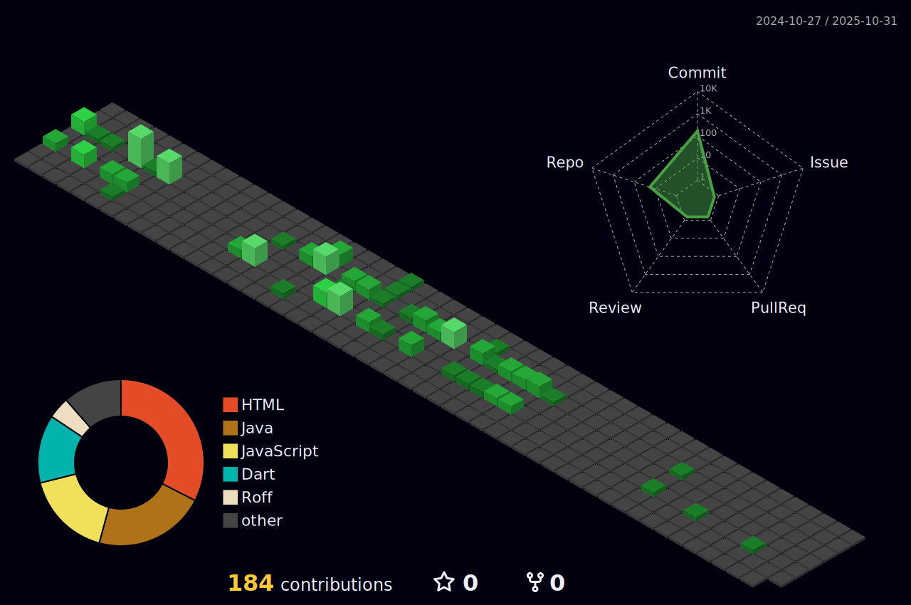

## 💜 Olá, meu nome é Júlio!

E sou estudante de **Desenvolvimento de Sistemas** no **SENAI Sorocaba**.  
Sou apaixonado por tecnologia, redes e infraestrutura, e estou sempre em busca de aprender mais e colocar em prática meus conhecimentos.

Aqui no meu GitHub, você vai encontrar projetos, exercícios e experimentos que desenvolvo durante meus estudos e aprendizados no SENAI.

## 🚀 Tecnologias e Ferramentas que estou aprendendo

- Python
- APIs REST
- Git e GitHub
- MySQL / PostgreSQL
- Node.js / JavaScript

## 💡 Interesses

- Desenvolvimento de APIs
- Integração com bancos de dados
- Boas práticas de código e arquitetura
- Segurança em aplicações web

---

## 🚀 Minhas Skills
  

   

  

## 📦 Commits

